# 🎓 University Course Management System – Final SQL Project

---

## 🧾 Project Overview
The **University Course Management System** is a comprehensive SQL-based project designed to simulate a real-world academic database system.

This project manages and analyzes data related to:
- Students  
- Courses  
- Instructors  
- Enrollments  
- Departments  

It demonstrates the practical implementation of SQL concepts such as joins, subqueries, aggregations, filtering, and data transformation.

---

## 🎯 Objectives
- Perform CRUD operations on relational tables  
- Apply filtering, sorting, and grouping  
- Use joins and subqueries effectively  
- Perform data analysis using aggregate functions  
- Apply date and string operations  
- Use CASE expressions for decision-making  

---

# 🗄️ Database Structure

## 📌 Tables in Database
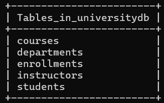

---

## 👨‍🎓 Students Table
**Fields:**
- StudentID  
- FirstName  
- LastName  
- Email  
- BirthDate  
- EnrollmentDate  

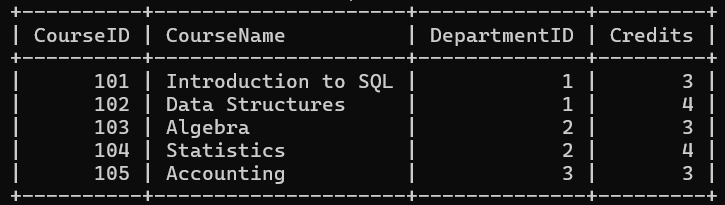

---

## 📚 Courses Table
**Fields:**
- CourseID  
- CourseName  
- DepartmentID  
- Credits  

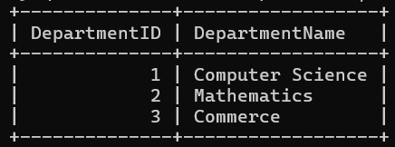

---

## 🏢 Departments Table
**Fields:**
- DepartmentID  
- DepartmentName  

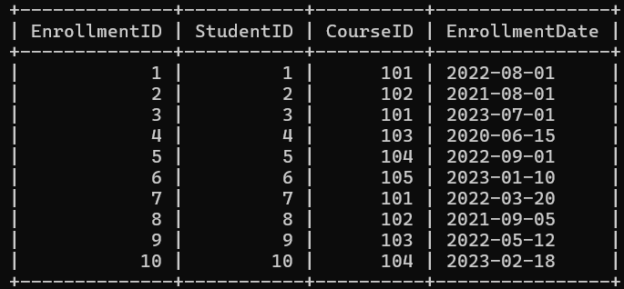

---

## 📝 Enrollments Table
**Fields:**
- EnrollmentID  
- StudentID  
- CourseID  
- EnrollmentDate  

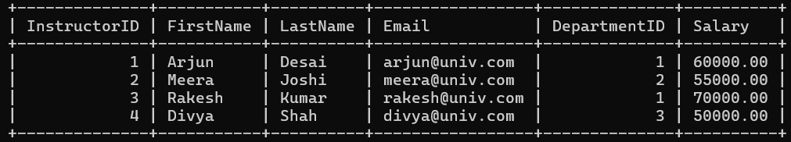

---

## 👩‍🏫 Instructors Table
**Fields:**
- InstructorID  
- FirstName  
- LastName  
- Email  
- DepartmentID  
- Salary  

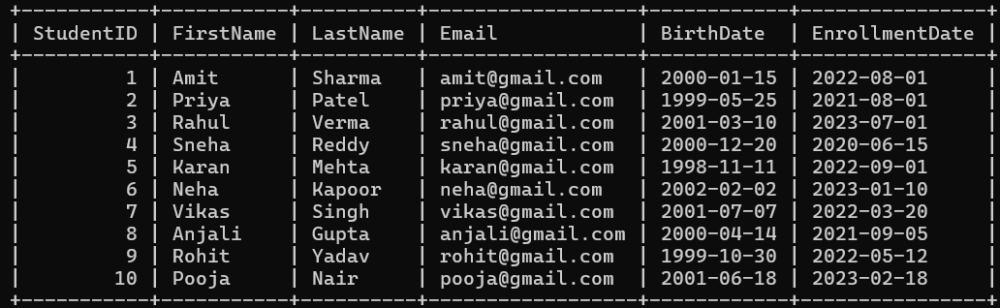

---

# 🔗 Queries & Explanation

---

## 🔹 Q1. CRUD Operations
**Task:** Perform basic insert, update, delete, and select operations.  
**Explanation:** These operations allow full control over database records and are essential for managing data.

---

## 🔹 Q2. Students Enrolled After 2022
**Task:** Retrieve students who enrolled after 2022.  
**Explanation:** Filters records using date conditions.

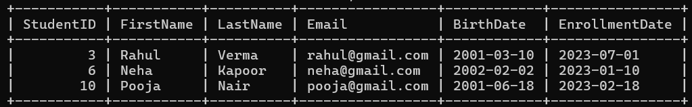

---

## 🔹 Q3. Courses by Mathematics Department
**Task:** Retrieve courses offered by Mathematics department (limit 5).  
**Explanation:** Filters courses based on department and limits output.

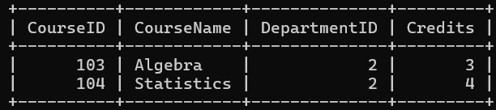

---

## 🔹 Q4. Students Count per Course (>5)
**Task:** Count students enrolled in each course where count is greater than 5.  
**Explanation:** Uses GROUP BY and HAVING for filtering grouped data.  
📌 *No output shown because no course has more than 5 students.*

---

## 🔹 Q5. Students in Both Courses
**Task:** Find students enrolled in both SQL and Data Structures.  
**Explanation:** Uses intersection logic to find common students.  
📌 *Output is minimal or may not appear depending on data.*

---

## 🔹 Q6. Students in Either Course
**Task:** Find students enrolled in either course.  
**Explanation:** Uses OR condition or IN clause to retrieve results.

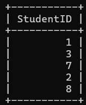

---

## 🔹 Q7. Average Course Credits
**Task:** Calculate average number of credits.  
**Explanation:** Uses AVG() function to compute mean value.

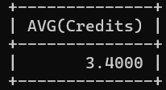

---

## 🔹 Q8. Maximum Instructor Salary
**Task:** Find highest salary in Computer Science department.  
**Explanation:** Uses MAX() function with filtering condition.

📌 Output:
- Maximum Salary = 70000

---

## 🔹 Q9. Students per Department
**Task:** Count number of students in each department.  
**Explanation:** Uses joins + grouping to analyze distribution.

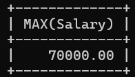

---

## 🔹 Q10. INNER JOIN
**Task:** Retrieve students and their enrolled courses.  
**Explanation:** Displays only matching records between tables.

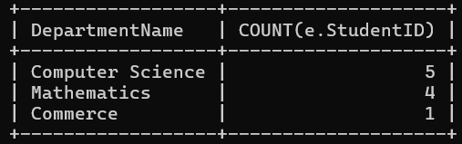

---

## 🔹 Q11. LEFT JOIN
**Task:** Retrieve all students and their courses (if any).  
**Explanation:** Includes students even if not enrolled.

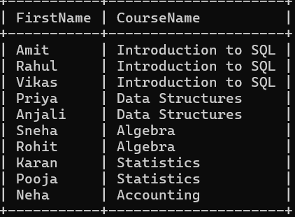

---

## 🔹 Q12. Subquery (Course Strength)
**Task:** Find students in courses having more than 10 students.  
**Explanation:** Uses nested query for filtering based on group conditions.  
📌 *No output because dataset does not meet condition.*

---

## 🔹 Q13. Extract Year
**Task:** Extract year from EnrollmentDate.  
**Explanation:** Uses YEAR() function for date transformation.

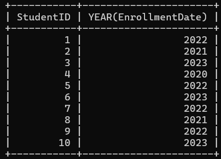

---

## 🔹 Q14. Instructor Full Name
**Task:** Concatenate first and last name.  
**Explanation:** Combines columns for better readability.

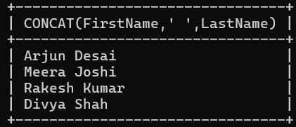

---

## 🔹 Q15. Total Students Count
**Task:** Count total number of students.  
**Explanation:** Uses COUNT() function.

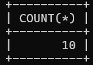

---

## 🔹 Q16. Student Classification
**Task:** Label students as Senior or Junior.  
**Explanation:** Uses CASE expression based on enrollment duration.

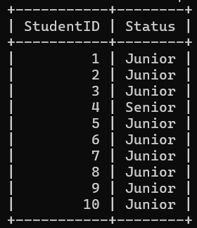

---

# ⚙️ Key Concepts Used
- SQL CRUD Operations  
- Joins (INNER, LEFT)  
- Subqueries  
- Aggregate Functions (COUNT, AVG, MAX)  
- Date Functions  
- String Functions  
- CASE Expressions  
- Data Filtering & Grouping  

---

# 🎯 Conclusion
This project demonstrates how SQL can be used to build and manage a real-world relational database system.

It provides strong understanding of:
- Data organization  
- Query optimization  
- Data analysis  

This project serves as a solid foundation for database development and analytics.

---

# 📌 Author
Dhrukesh kanani

---

✨ *Bring on your coding attitude* ✨
